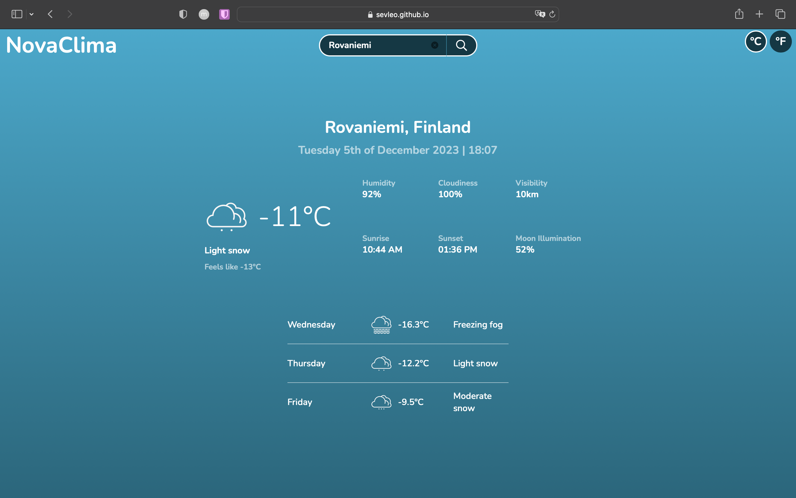

# NovaClima

NovaClima is a weather app I built to practice using APIs. It helps you check the current weather and daily forecasts for any location. It's a simple tool that demonstrates my skills in fetching and displaying weather data on a web page.

## Table of Contents

- [Demo](#demo)
- [Technologies used](#technologies)
- [Contributing](#contributing)
- [License](#license)

## Demo

You can view the project at [NovaClima](https://sevleo.github.io/TOP-NovaClima/).

## Technologies

- Vanilla JS
- CSS
- HTML
- Webpack
- Weather API
- date-fns

## Contributing

Contributions are enthusiastically welcomed! Whether you're keen on improving mobile responsiveness, enhancing UI/UX elements, or optimizing performance, follow these guidelines to contribute:

1.  Fork the repository.
2.  Create a new branch for your feature or bug fix.
3.  Make your changes and commit them.
4.  Push your changes to your fork.
5.  Create a pull request.

## License

This project is licensed under the [MIT LICENSE](./LICENSE)
